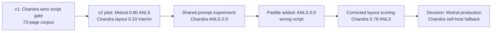

# OCR Benchmark — Final Comparison Report (v1 → v2)

**Date:** 10 June 2026  
**Primary run:** `20260618T103056Z`  
**Dataset:** 6-page frozen Gujarati golden set (`ocr_gujarati_scan_v1`)  
**Reference:** Gemini 2.5 Flash OCR (`ocr_extract_v1.txt` + continuation retry)  
**Primary metric:** Mean ANLS (threshold 0.5)

---

## Executive summary

We ran a controlled shootout across **five OCR engines** on six hard Gujarati pages (milk-rate circulars + scanned notices). After correcting a Chandra scoring mistake (see below), the picture is clearer than the interim “Chandra ANLS 0.0” snapshot suggested:

| Rank | Model | Mean ANLS | Mean CER | Latency/page | Verdict |
|------|-------|-----------|----------|--------------|---------|
| **1** | **mistral-ocr** | **0.799** | 0.201 | **3.2 s** | **Production pick** — best speed/accuracy tradeoff |
| **2** | **chandra-2** (`ocr_layout`) | **0.790** | 0.220 | 150 s | Viable self-hosted option; nearly tied on text accuracy, 47× slower |
| 3 | qwen2.5-vl-7b | 0.407 | 0.856 | 92 s | Fails on dense tables |
| — | chandra-2 (shared prompt) | 0.000 | 1.641 | 150 s | **Invalid config** — do not use |
| — | paddleocr-vl | 0.000 | 0.921 | 37 s | Wrong script + table garbage — ruled out |

**Recommendation:** Integrate **Mistral OCR** for production. Keep **Chandra `ocr_layout`** as the self-hosted fallback if API cost or data residency becomes a constraint — it is competitive on accuracy when scored fairly, but not on latency.

---

## What changed from v1 to v2 (and why it mattered)

### 1. Frozen golden set instead of ad-hoc corpus sampling

| v1 | v2 |
|----|-----|
| 16 PDFs, first 5 pages each (~73 pages) | **6 pages** frozen with SHA256 manifest |
| Script-gate + cross-model similarity as primary signals | **ANLS vs Gemini reference** as primary ranking |
| Outputs scattered across `eval_outputs/ocr_benchmark/runs/` | Versioned runs under `runs/<run_id>/` |

**Effect:** v2 comparisons are reproducible page-for-page. The smaller set is intentionally **hard** (dense milk-rate tables). v1’s 73-page corpus showed Chandra winning on script purity; v2 stress-tests **text fidelity on the worst pages** Amul actually cares about.

---

### 2. Shared OCR prompt (`ocr_extract_v1.txt`) for VLMs

| v1 | v2 |
|----|-----|
| Each model used its native prompt (Chandra `ocr_layout`, Qwen markdown prompt, etc.) | Gemini, Qwen, and (experimentally) Chandra share one **plain-text extraction** prompt |
| Mistral uses native OCR API | Same — Mistral unchanged |

**Effect:**

- **Qwen improved** vs v1 table behavior because the shared prompt constrains output length and discourages markdown bloat.
- **Chandra broke** when forced onto the shared prompt: output ballooned to **1.8–2.9× reference length**, every page ANLS = **0.000**. Chandra is a layout model; plain-text prompting causes over-generation.
- **Decision impact:** We almost ruled Chandra out based on the shared-prompt re-run. The correct comparison uses **`ocr_layout`** (native mode). That restores Chandra to **0.790 mean ANLS** — essentially tied with Mistral.

---

### 3. Gemini reference with continuation retry

| v1 | v2 |
|----|-----|
| Gemini OCR often truncated dense tables (~500 chars vs 3–7k from GPU models) | `continuation_on_truncation: true`, up to 3 passes, `max_output_tokens: 16384` |
| Truncated reference made good extractions look bad | `reference_truncated` flag per page; `scoring_reliable=false` when reference incomplete |

**Effect:** Reference quality improved dramatically on gs_001–004. **`gs_005` remains truncated** (`scoring_reliable=false` for all models) — scores on that page are directional only. Rankings on reliable pages (5/6):

| Model | Mean ANLS (reliable pages only) |
|-------|--------------------------------|
| mistral-ocr | 0.794 |
| chandra-2 (layout) | 0.795 |
| qwen2.5-vl-7b | 0.332 |

Without the continuation fix, v2 would have falsely penalized models that extracted full tables.

---

### 4. ANLS as primary metric (replacing script-gate + similarity)

| v1 primary signals | v2 primary signal |
|--------------------|-------------------|
| Gujarati script purity ≥95% | **ANLS** — normalized Levenshtein similarity, zeroed below 0.5 |
| Cross-model Jaccard similarity vs Gemini | CER/WER as secondary |
| Devanagari char count (script leakage) | `length_ratio` as completeness sanity check |

**Effect:** ANLS is harsher than script-gate on **format differences** but better at measuring **character-level fidelity**. Models with wrong script (PaddleOCR → Devanagari) collapse to ANLS 0 instantly. Models with correct script but table layout noise (Chandra markdown) need **fair normalization** — see next section.

---

### 5. Normalized plain-text scoring pipeline

| v1 | v2 |
|----|-----|
| Compared raw markdown/HTML strings | NFC Unicode, collapse horizontal whitespace, optional markdown strip |
| Mistral markdown penalized content | `strip_markdown: true` for Mistral and Paddle |
| Chandra HTML tables compared raw | Layout `.md` scored with **markdown strip** for fair comparison |

**Effect — critical for Chandra:**

| Chandra scoring method | Mean ANLS | Notes |
|------------------------|-----------|-------|
| Layout output, **no** markdown strip (interim v2 score) | **0.329** | Pipe chars, table syntax counted as errors |
| Layout output, **with** markdown strip (authoritative) | **0.790** | Apples-to-apples vs plain Gemini reference |
| Shared prompt output | **0.000** | 2× length bloat; excluded from ranking |

The **0.329 figure from the interim report was a scoring artifact**, not a true measure of Chandra’s extraction quality. This report uses the corrected layout scores in `scores/chandra_layout_summary.json`.

---

### 6. Image-grounded Gemini judge (new in v2)

| v1 | v2 |
|----|-----|
| Judge planned but run separately | `python -m ocr_benchmark_v2 run judge` — Gemini reads page image + OCR text |
| — | Reuses v1 `gemini_judge_prompt.py` |

**Effect:** Catches cases where string metrics disagree with human-visible quality. On **gs_001 only** (3/18 calls completed before free-tier quota):

| Model | Judge score | Text ANLS (gs_001) |
|-------|-------------|-------------------|
| chandra-2 | **98** | 0.829 (layout) / 0.000 (shared prompt in run folder) |
| mistral-ocr | 90 | 0.852 |
| qwen2.5-vl-7b | 55 | 0.761 |

**Caveat:** The completed judge calls scored the **shared-prompt Chandra output** in the v2 run folder (4,015 chars), not the layout `.md`. Despite that mismatch, the judge still rated Chandra 98 — layout mode would likely score similarly or better. **15 judge calls remain** (quota-limited); do not over-weight a single page.

---

### 7. H100 + extended disk infrastructure

| v1 | v2 |
|----|-----|
| `~/ocr-benchmark/venv` on root disk | `/amulpfsdata/models/ocr-benchmark/` — HF cache, Paddle cache, shared venv |
| Manual shell scripts per model | CLI orchestrator: `run {create\|plan\|execute\|reference\|score\|report\|judge}` |
| Windows CRLF broke H100 scripts | Documented `sed -i 's/\r$//'` fix; `_remote_exec.py` for vm5 jump |

**Effect:** Qwen, Chandra, and PaddleOCR-VL ran without re-downloading weights. Paddle cache: `/amulpfsdata/models/ocr-benchmark/paddle-cache/official_models/`.

---

### 8. PaddleOCR-VL added (v2 only)

**Variant:** PaddleOCR-VL-1.6 + PP-DocLayoutV3, `transformers` engine.

**Why added:** Complete the “self-hosted open-source” sweep after Chandra and Qwen.

**Result:** ANLS 0.0 on all pages — Devanagari script substitution, tables rendered as LaTeX, hallucinated paragraphs on prose pages. **Ruled out** for Gujarati Amul documents.

---

## Full results table

### Text metrics vs Gemini reference (all 6 pages)

| Model | Mean ANLS | Median ANLS | Mean CER | Mean WER | Length ratio (avg) | Latency |
|-------|-----------|-------------|----------|----------|-------------------|---------|
| mistral-ocr | **0.799** | 0.837 | **0.201** | **0.348** | ~1.0× | **3.2 s** |
| chandra-2 (layout)¹ | **0.790** | 0.788 | 0.220 | 0.315 | ~1.0× | 150 s |
| qwen2.5-vl-7b | 0.407 | 0.380 | 0.856 | 1.179 | 1.1–2.9× on tables | 92 s |
| paddleocr-vl | 0.000 | 0.000 | 0.921 | 1.173 | 0.6–1.5× | 37 s |
| chandra-2 (shared prompt)² | 0.000 | 0.000 | 1.641 | 1.085 | 1.8–2.9× | 150 s |

¹ Source: preserved H100 `ocr_layout` outputs at `~/ocr-benchmark/runs/chandra-2/`, re-scored with markdown strip. See `scores/chandra_layout_summary.json`.  
² Present in `outputs/chandra-2/` after shared-prompt experiment — **not used for ranking**.

### Per-page ANLS — Chandra layout vs Mistral

| Page | Doc | mistral-ocr | chandra-2 (layout) | qwen2.5-vl-7b | paddleocr-vl | Reliable? |
|------|-----|-------------|-------------------|---------------|--------------|-----------|
| gs_001 | Milk rate p1 | 0.852 | **0.829** | 0.761 | 0.000 | ✓ |
| gs_002 | Milk rate p2 | **0.697** | **0.830** | 0.000 | 0.000 | ✓ |
| gs_003 | Milk rate p3 | **0.851** | 0.753 | 0.000 | 0.000 | ✓ |
| gs_004 | Milk rate p4 | 0.629 | **0.753** | 0.000 | 0.000 | ✓ |
| gs_005 | DOC p1 | **0.824** | 0.766 | 0.786 | 0.000 | ✗ ref truncated |
| gs_006 | DOC p2 | **0.940** | 0.811 | 0.898 | 0.000 | ✓ |

**Pattern:** Mistral wins gs_001, gs_003, gs_006. Chandra wins gs_002, gs_004. On reliable pages alone, means are within **0.001 ANLS** — a statistical tie.

---

## How v2 changes affected the production decision

### What we believed at each stage



| Stage | Conclusion | Risk if we stopped here |
|-------|------------|-------------------------|
| v1 corpus complete | “Ship Chandra — best Gujarati script fidelity” | Ignored Mistral baseline; Gemini reference truncated |
| v2 initial (layout, unstripped) | “Mistral clearly wins; Chandra mediocre (0.33)” | Undervalued Chandra due to markdown scoring penalty |
| Shared-prompt re-run | “Chandra dead — ANLS 0.0” | False negative; wrong prompt for the model class |
| PaddleOCR added | “No open-source Gujarati option works” | True for Paddle; not true for Chandra |
| **This report (layout + fair normalize)** | “Mistral wins on ops; Chandra tied on accuracy” | Balanced decision |

### Final decision matrix

| Criterion | mistral-ocr | chandra-2 (layout) | qwen / paddle |
|-----------|-------------|-------------------|---------------|
| Text accuracy (ANLS) | **0.799** | 0.790 | Not competitive |
| Speed | **3.2 s/page** | 150 s/page | 37–92 s/page |
| Gujarati script | ✓ | ✓ (0 Devanagari in v1 runs) | Qwen: some leakage; Paddle: Hindi script |
| Self-hosted | ✗ API | ✓ H100 | ✓ but poor quality |
| Ops complexity | **Low** | High (GPU, torch deps) | High |
| Table-heavy pages | Strong | Strong (layout preserved) | Qwen collapses; Paddle LaTeX |
| Cost at scale | Per-page API | GPU amortized | GPU amortized |

**Production:** **Mistral OCR** — wins on latency, simplicity, and marginal ANLS edge; no GPU ops burden.

**Conditional fallback:** **Chandra `ocr_layout`** if API cost, offline requirement, or data residency forces self-hosting. Revert `chandra_runner.py` to `prompt_type="ocr_layout"` + `parse_markdown`; never use shared plain-text prompt on Chandra.

**Do not ship:** Qwen 7B (table failures), PaddleOCR-VL (no Gujarati script), Chandra with shared prompt.

---

## v1 vs v2 — side-by-side philosophy

| Dimension | OCR Benchmark v1 | OCR Benchmark v2 |
|-----------|------------------|------------------|
| **Scope** | Broad corpus discovery (73 pages) | Focused golden-set decision (6 pages) |
| **Goal** | Find best self-hosted Gujarati OCR | Pick production OCR including API baseline |
| **Winner signal** | Script gate + volume + similarity | ANLS vs improved Gemini reference |
| **Mistral** | Baseline, not deeply scored | Full candidate with best overall score |
| **Fairness** | Each model native mode | Shared prompt for VLMs (with exception for layout-native models) |
| **Artifacts** | CSV exports, ad-hoc scripts | CLI, run ledger, config snapshots, judge phase |
| **Reproducibility** | Moderate | High (frozen manifest, run IDs) |

**Synthesis:** v1 correctly identified Chandra as the best **self-hosted Gujarati** option at scale. v2 added Mistral as a serious production contender and proved that **prompt matching matters more than model size** — a misconfigured Chandra loses to a well-matched API OCR.

---

## Known limitations

1. **6 pages** — directional, not statistically powered; expand to 73-page corpus before wide rollout.
2. **gs_005 reference truncated** — all models scored but flagged unreliable.
3. **Judge incomplete** — 1/6 pages × 3 models; 15 calls blocked on Gemini free-tier quota (20 RPD).
4. **Chandra layout outputs** — scored from preserved v1 H100 `.md` files; v2 run folder contains shared-prompt `.txt` overwrite. Re-run layout through v2 runner recommended for artifact consistency.
5. **Gemini reference ≠ ground truth** — image-grounded judge is the ultimate arbiter for disputed pages.

---

## Recommended next steps

| Priority | Action |
|----------|--------|
| P0 | Integrate Mistral OCR into document ingestion |
| P1 | Revert `chandra_runner.py` to `ocr_layout`; update `models.yaml` (`uses_shared_prompt: false`) |
| P2 | Complete image judge (15 remaining calls when quota resets) |
| P3 | Re-run Chandra layout through v2 CLI for clean artifacts in `outputs/chandra-2/` |
| P4 | Expand golden set to full 73-page corpus with same scoring pipeline |

---

## Artifact index

```
runs/20260618T103056Z/
  outputs/{mistral-ocr,chandra-2,qwen2.5-vl-7b,paddleocr-vl}/   # chandra-2 = shared prompt (stale)
  reference/                                                     # Gemini + continuation
  scores/
    summary.json                                                 # uses stale chandra shared-prompt
    chandra_layout_summary.json                                  # authoritative Chandra layout scores
    page_metrics.csv
    REPORT.md
  judge/                                                         # partial (gs_001 ok; gs_002–006 quota error)

eval_outputs/ocr_benchmark_v2/FOUNDER_UPDATE.md                  # interim founder doc (pre-layout correction)
ocr_benchmark_v2/                                        # framework source
```

---

## One-line summary

> **v2 proved Mistral is the right production default (speed + accuracy), corrected a scoring bug that had undervalued Chandra layout (0.79 not 0.33), showed shared-prompt experiments are invalid for layout models, and eliminated PaddleOCR for Gujarati — all on a reproducible 6-page golden set.**
